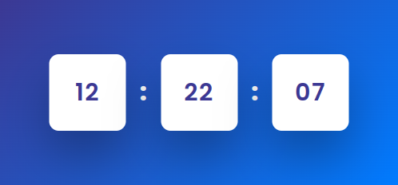

# Mini Proyecto de Reloj Digital en JavaScript

## Descripción

Este es un mini proyecto de reloj digital interactivo creado con JavaScript. El proyecto ha sido creado con fines educativos para practicar el uso de la clase `Date` de JavaScript y la función `setInterval`.

## Funcionalidad

El reloj muestra la hora actual en formato de 24 horas. Actualiza la hora automáticamente cada segundo para asegurar que la hora mostrada es siempre precisa.

El código JavaScript maneja la funcionalidad del reloj. Utiliza la clase `Date` para obtener la hora actual y la función `setInterval` para actualizar la hora en la pantalla cada segundo.

## Prueba el Reloj

Para probar el reloj, simplemente ve a la página de demostración alojada en GitHub Pages haciendo click en el siguiente enlace:

* https://pablospata.github.io/reloj-digital-js/